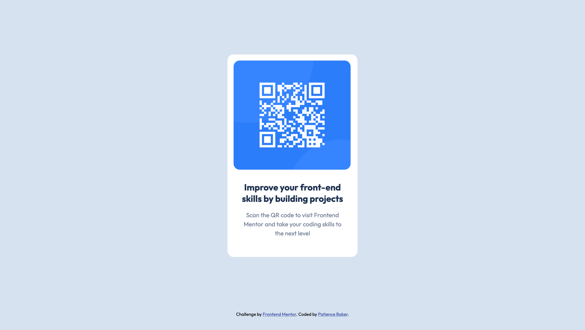
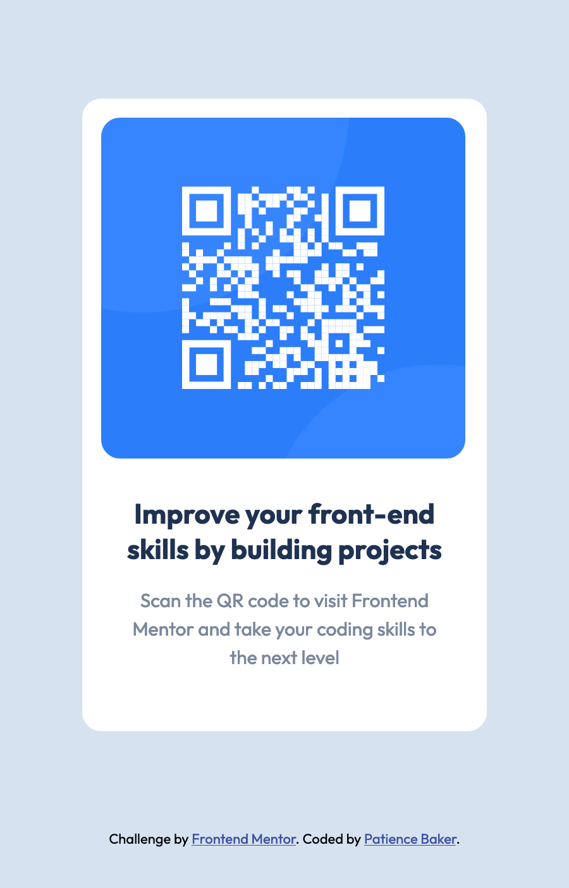

# Frontend Mentor - QR code component solution

This is a solution to the [QR code component challenge on Frontend Mentor](https://www.frontendmentor.io/challenges/qr-code-component-iux_sIO_H). Frontend Mentor challenges help you improve your coding skills by building realistic projects. 

## Table of contents

- [Overview](#overview)
  - [Screenshot](#screenshot)
- [Author](#author)

## Overview
The primary goal of this challenge is to build out a QR code component and get it looking as close to the orginal design as possible. You can find the original design for desktop and mobile in the design folder. 

### Screenshot

## Author
- Frontend Mentor - [@Iampbaker](https://www.frontendmentor.io/profile/Iampbaker)

